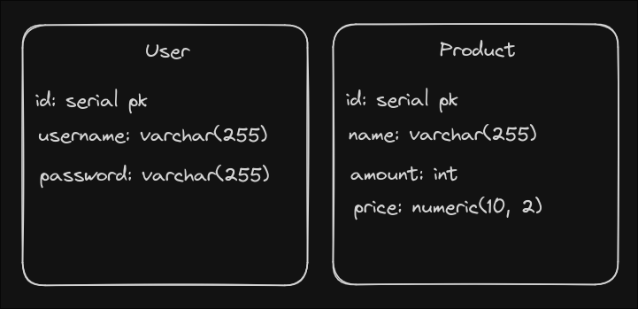

# Loja

**Aplicação desktop para o gerenciamento de estoques** desenvolvida como exame
de suficiência para disciplina de Oficina de Integração 2.

## Requisitos funcionais

1. Cadastro de usuários
1. Login de usuários
1. Cadastro de produtos
1. Listagem de produtos
1. Atualização de produtos
1. Busca de produtos
1. Exclusão de produtos

## Arquitetura

## Tabelas do banco:

## Arquitetura de alto nível

## Estratégia de testes

Definir a lógica de negócio em "Services" e testá-los por meio de testes
unitários e de integração com o banco de dados utilizado.

## Tecnologias usadas

1. Java v22, Swing para GUI e JDBC para conexão com banco
1. Postgresql v15 como SGBD 
1. JUnit para testes automatizados
